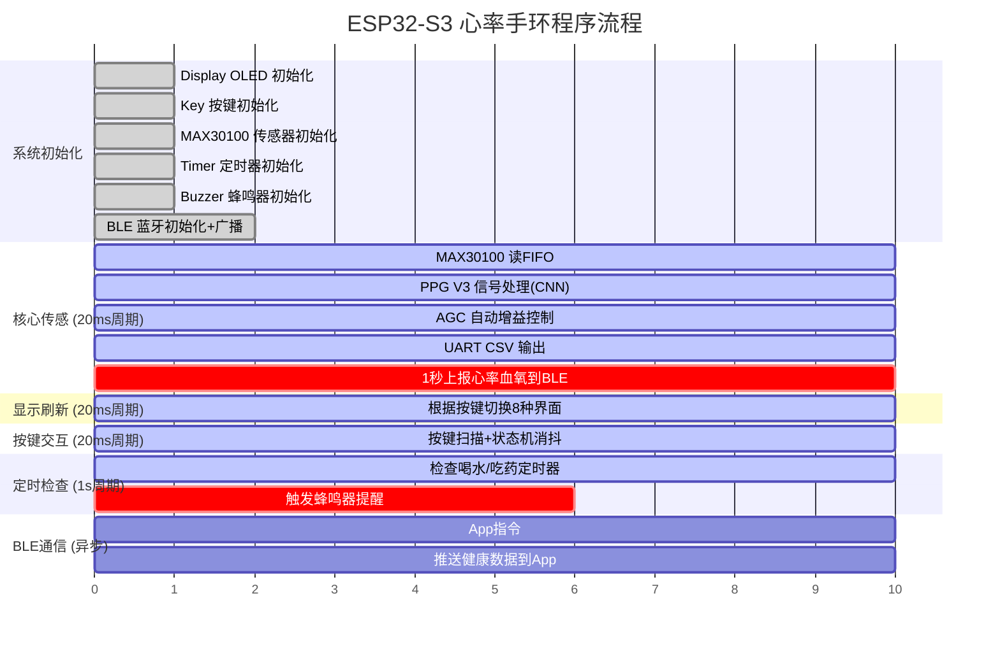

## 程序流程图

```mermaid
gantt
    title ESP32-S3 心率手环程序流程
    dateFormat X
    axisFormat %s

    section 系统初始化
    Display OLED 初始化     :done, d1, 0, 1
    Key 按键初始化          :done, k1, 0, 1
    MAX30100 传感器初始化    :done, m1, 0, 1
    Timer 定时器初始化       :done, t1, 0, 1
    Buzzer 蜂鸣器初始化      :done, b1, 0, 1
    BLE 蓝牙初始化+广播      :done, ble1, 1, 2

    section 核心传感 (20ms周期)
    MAX30100 读FIFO         :active, ppg1, 2, 10
    PPG V3 信号处理(CNN)    :active, ppg2, 2, 10
    AGC 自动增益控制        :active, ppg3, 2, 10
    UART CSV 输出           :active, ppg4, 2, 10
    1秒上报心率血氧到BLE     :crit, ble2, 3, 10

    section 显示刷新 (20ms周期)
    根据按键切换8种界面       :active, dis, 2, 10

    section 按键交互 (20ms周期)
    按键扫描+状态机消抖       :active, key, 2, 10

    section 定时检查 (1s周期)
    检查喝水/吃药定时器       :active, tim, 2, 10
    触发蜂鸣器提醒           :crit, tim2, 5, 6

    section BLE通信 (异步)
    App指令: 设置/取消定时    :ble3, 3, 10
    推送健康数据到App        :ble4, 3, 10
```
